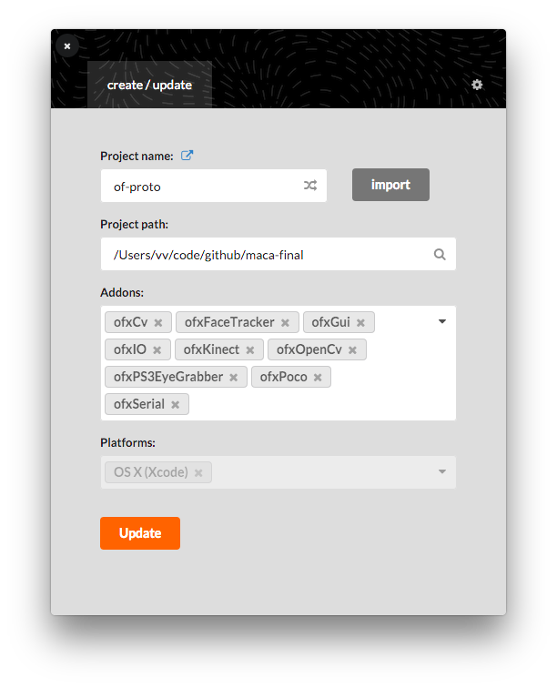

# paintball-paintings

The openframeworks app requires several different addons:

1. ofxOpenCv
2. ofxPoco
3. ofxGui
4. ofxKinect (required for the libusb driver)
5. [ofxIO](https://github.com/bakercp/ofxIO)
6. [ofxSerial](https://github.com/bakercp/ofxSerial) 
7. [ofxCv](https://github.com/kylemcdonald/ofxCv)
8. [ofxPS3EyeGrabber](https://github.com/bakercp/ofxPS3EyeGrabber)
9. [ofxFaceTracker](https://github.com/kylemcdonald/ofxFaceTracker)

### Installing the addons
You can either run the `setup.py` using python3 (which will go through through each require addon and clone it) or manually download each addon and put it in your openframeworks addons folder.

#### Using setup.py

1. Open the `setup.py` with a text editor and set the `OF_ROOT` variable to your openframeworks installation folder. In my case, it is `/Volumes/LaCie3TBYas/Code/c++/of_v0.10.0_osx_release` so I will change it like this:
`OF_ROOT="/Volumes/LaCie3TBYas/Code/c++/of_v0.10.0_osx_release"`

1. open a terminal window and `cd` into the main folder of this repo (maca-final)

2. run `python3 setup.py`
